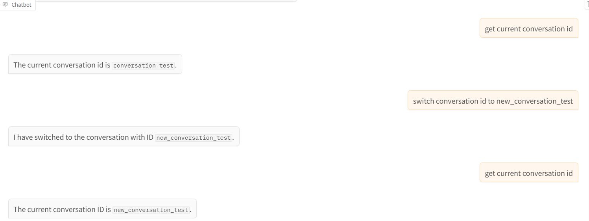
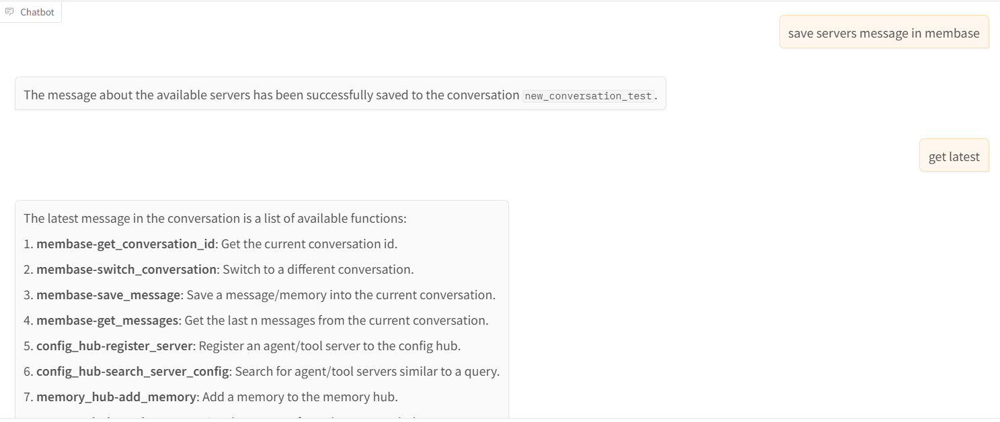

# membase mcp server

## Description

Membase is the first decentralized memory layer for AI agents, powered by Unibase. It provides secure, persistent storage for conversation history, interaction records, and knowledge — ensuring agent continuity, personalization, and traceability.

The Membase-MCP Server enables seamless integration with the Membase protocol, allowing agents to upload and retrieve memory from the Unibase DA network for decentralized, verifiable storage.

## Functions

Messages or memoiries can be visit at: <https://testnet.hub.membase.io/>

- **get_conversation_id**: Get the current conversation id.
- **switch_conversation**: Switch to a different conversation.
- **save_message**: Save a message/memory into the current conversation.
- **get_messages**: Get the last n messages from the current conversation.

## Installation

```shell
git clone https://github.com/unibaseio/membase-mcp.git
cd membase-mcp
uv run src/membase_mcp/server.py
```

## Environment variables

- MEMBASE_ACCOUNT: your account to upload
- MEMBASE_CONVERSATION_ID: your conversation id, should be unique, will preload its history
- MEMBASE_ID: your instance id

## Configuration on Claude/Windsurf/Cursor/Cline

```json
{
  "mcpServers": {
    "membase": {
      "command": "uv",
      "args": [
        "--directory",
        "path/to/membase-mcp",
        "run", 
        "src/membase_mcp/server.py"
      ],
      "env": {
        "MEMBASE_ACCOUNT": "your account, 0x...",
        "MEMBASE_CONVERSATION_ID": "your conversation id, should be unique",
        "MEMBASE_ID": "your sub account, any string"
      }
    }
  }
}
```

## Usage

call functions in llm chat

- get conversation id and switch conversation



- save message and get messages


